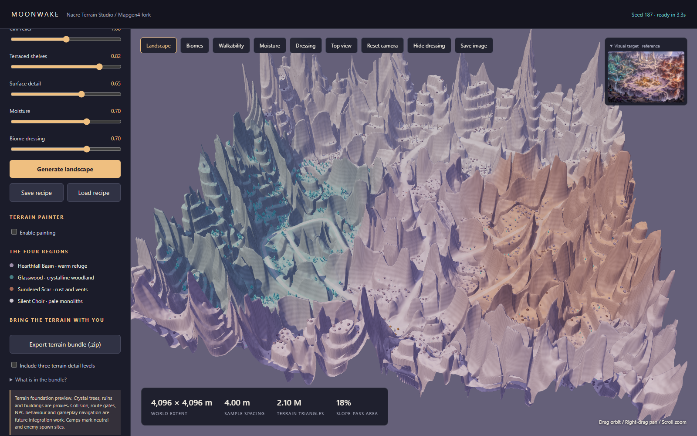

# Moonwake / Nacre Terrain Studio

A separate terrain-authoring fork of [Red Blob Games Mapgen4](https://github.com/redblobgames/mapgen4). This repository is independent of the Moonwake Godot game. It generates actual terrain geometry and data for later game integration.



## Start

Requires Node.js 22 or newer. From this folder:

```sh
npm ci
npm run build
npm start
```

Open **http://127.0.0.1:5174**. Choose a seed, world size and sample count, then Generate. Drag to orbit, right-drag to pan, and scroll to zoom. The original paintable Mapgen4 is retained at `/embed.html`.

## What this version does

- Uses Mapgen4's real Poisson/Delaunay dual mesh, seeded elevation, wind-driven rainfall and river-flow algorithms as its macro field.
- Applies a Moonwake layout with a sheltered southern colony, west Glasswood, eastern Scar and northern Choir.
- Authors inland mountain ridges, terraces, ravines, seed-varied curved routes and protected objective clearings.
- Randomizes two NPC camp sites (one neutral and one enemy), with clearings and connected approaches.
- Paints cliffs, paths, build areas, biome blends, local dressing density and moisture directly onto the 3D terrain; edits are replayable and exportable.
- Generates deterministic crystal woodland, rocks, monoliths, fungal caps and vent placement data.
- Previews real 3D meshes with orbit controls, biome and walkability views, reference image and schematic colony/relay proxies.
- Exports chunked GLB terrain, three uniform detail levels, a **16-bit grayscale height PNG**, float32/R16 heights, biome weight/ID masks, slopes, candidate walk/build masks and placement metadata.
- Saves and reloads recipes; the same recipe reproduces terrain and placements.

| Preset | Samples | Spacing | LOD0 triangles |
|---|---:|---:|---:|
| 256 m campaign | 513 × 513 | 0.5 m | 524,288 |
| 1,024 m open world | 1025 × 1025 | 1 m | 2,097,152 |
| 4,096 m frontier | 1025 × 1025 | 4 m | 2,097,152 |

World dimensions and resolution are independent. A 1 km map at 129 samples is a coarse preview, not metre-resolution terrain. The studio displays spacing explicitly. Changes to controls require Generate; exports and Save recipe use the last generated world.

### Increase walkable terrain

Raise **Walkable terrain** under Landscape character, then click **Generate landscape**. Higher strength expands gentle ground between mountain ridges. Seeded ridge crests remain in the interior as natural boundaries. Use **Walkability** to inspect the measured slope-pass area; the slider is shaping strength, not a requested area percentage or a change to the 30-degree slope limit.

New worlds use generator version 2. Loading a version 1 recipe preserves its original layout and shaping rules. New recipes explicitly record the generator version.

### Paint the world

Enable **Terrain painter → Enable painting**. Choose a feature, radius in metres and strength. The projected circle follows the ground. Hold the left mouse button to increase and the right mouse button to decrease. Disable painting to orbit/pan; scroll still zooms while painting.

| Feature | Left hold | Right hold |
|---|---|---|
| Cliffs / hills | Raise local terrain with a soft shoulder | Lower local terrain |
| Blend / smooth slopes | Gradually average neighboring heights within the brush | Blend back toward the original generated relief |
| Path | Add a path reservation and level toward the stroke's starting height | Remove painted reservation and blend toward generated terrain |
| Build area | Add a building reservation and level toward the stroke's starting height | Remove painted reservation and blend toward generated terrain |
| Biome | Increase the selected biome's blend weight | Redistribute that weight to other biomes |
| Biome dressing | Increase local scenery density | Thin local scenery |
| Moisture | Increase local wetness data | Decrease local wetness data |

Blend softens ridges and fills small depressions with a feathered edge. Brush radius controls the affected area and averaging scale; strength and hold duration control smoothing. Protected routes and clearings retain their heights. Use Undo stroke to recover the exact pre-stroke shape; right-click returns toward generated terrain.

Changes appear during the stroke. Dressing refreshes at a throttled rate; final slopes, statistics and placements settle when released. **Undo stroke** removes the last complete drag; **Clear painting** restores the generated world. Painting automatically selects a useful inspection view for each data layer. A build reservation only becomes a build candidate when it meets the slope and exclusion rules.

Generated routes, POI/camp clearings, and an actual connected walkable chain with its neighboring height samples are protected from height edits. This keeps terrain access open even when raising nearby cliffs. NPC allegiance is metadata and tent markers; NPC AI and game navigation remain future Godot work.

**Save recipe** and **Export terrain bundle** include painting. Generating with a changed seed replays edits on the new world; changing world size scales edit positions, radii and target elevations proportionally. A brush covers at least two sample intervals so it remains usable on coarse previews. At 4,096 m, the 1025-sample limit means 4 m spacing; fine trails and building footprints still need finer tile generation in a later production pipeline.

## Command-line generation

```sh
npm run generate -- --size 1024 --resolution 1025 --seed 187 --out exports/nacre-1024
npm run generate -- --recipe exports/nacre-1024/recipe.json --out exports/reproduced
npm run generate -- --size 4096 --resolution 1025 --walkability 1 --out exports/nacre-frontier
```

Generated bundles are ignored by Git because high-resolution worlds can be large. See [the export contract](moonwake/docs/EXPORTS.md), [architecture](moonwake/docs/ARCHITECTURE.md) and [production scope](moonwake/docs/PRODUCTION.md).

## Verify

```sh
npm test
npm run test:browser
```

Browser tests use installed Chrome on Windows; override `CHROME_PATH` elsewhere. No browser download is required. Tests check determinism, protected terrain, region connectivity for the reference seed, chunk seams, binary export content and the UI export flow. Performance and Godot loading evidence are recorded in [validation](moonwake/docs/VALIDATION.md).

## Reference fidelity and limits

The user-supplied concept guides terrain composition, color families, terraces and regional props. This is a **terrain foundation**, not a reconstruction of every painted building, crystal or overhang. The heightfield cannot represent caves or overhangs. Buildings and vegetation in the viewer are low-poly proxies; replace them with production assets later. Slope masks are candidates, not game navigation or construction approval. Route unlock gates are exported metadata only. The 1 km preset scales the regional composition and is a future expansion design, not the original campaign's unchanged pacing.

No code, scenes, settings or assets are written to the main Godot project. Exports must be imported separately when that development work is authorized.

## Attribution

Original Mapgen4 and dual-mesh code: Red Blob Games, Apache-2.0; copyright notices and [LICENSE](LICENSE) retained. The small PRNG helper is vendored at upstream's locked revision `1104cf92f9824d71cf631eeeedd5866e9b62ea9f` under its existing Apache-2.0 license, so installation does not need Git-based package fetching. See [third-party notices](moonwake/docs/THIRD_PARTY.md). Moonwake additions use the repository's Apache-2.0 code license. The supplied visual reference has separate provenance and is not automatically relicensed as Apache code.

The original upstream documentation remains in [README.org](README.org).
