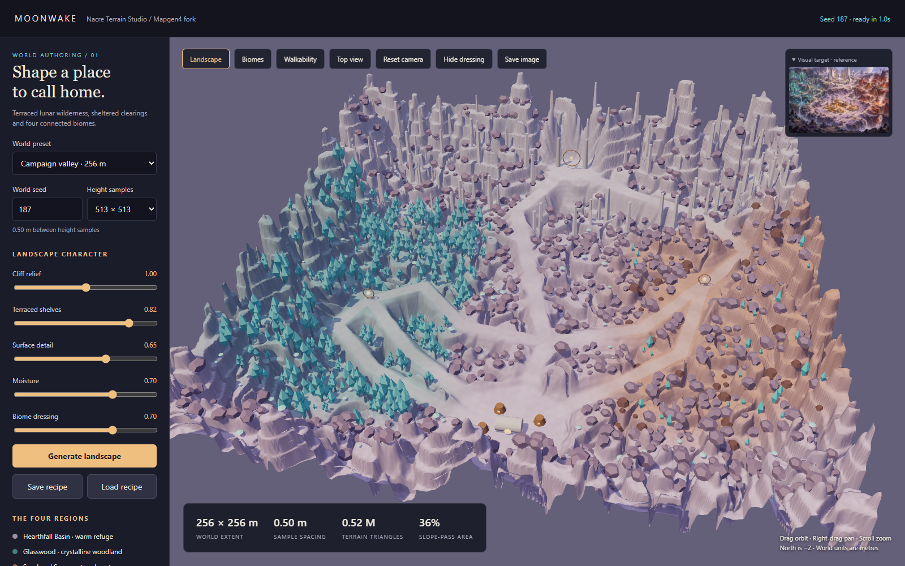
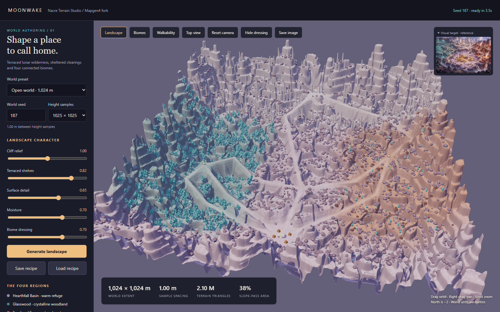
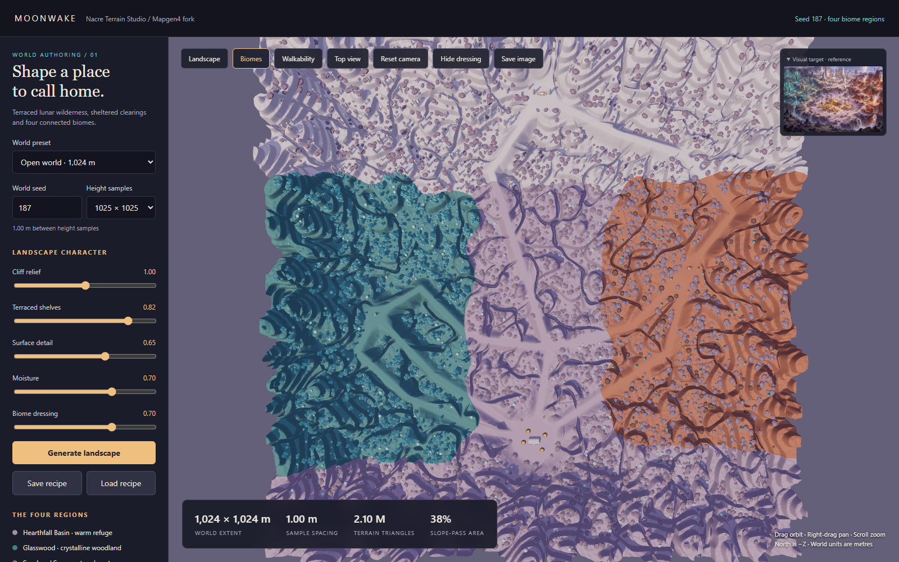
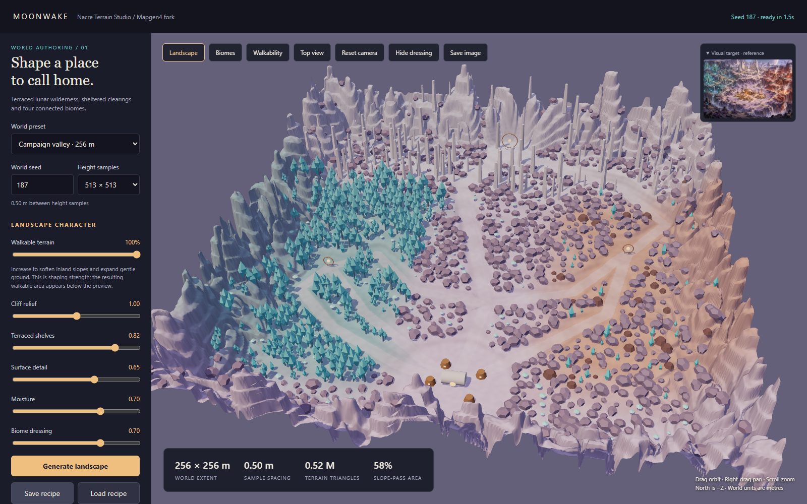

# Validation / 1 October 2026

## Results

| Check | Result |
|---|---|
| Cross-platform build: studio, worker, CLI, tests and original demo | Passed |
| TypeScript check (`npm run typecheck`) | Passed |
| Terrain and export tests | 13 passed, 0 failed |
| Browser tests on installed Chrome | 3 passed, 0 failed |
| 1 km / 1025-sample CLI generation | Passed |
| Godot 4.7.2 glTF loading | 768 / 768 files passed |
| Static terrain collision shape creation | 256 / 256 full-detail tiles passed |
| Dependency audit during installation | 0 reported vulnerabilities at time of check |

The browser checks cover initial rendering, biome and walkability views, scenery visibility, recipe download, generation after changing resolution, ZIP download, loading a 1 km recipe and rendering its metre-spaced terrain. No page errors were recorded in the passing runs. The screenshots below show actual generated geometry rather than the target painting.







## Reproducibility and geometry checks

The tests compare full height arrays, biome blends and placements for repeated seeds. Different seeds change terrain while retaining landmark locations. All four biome weights sum to 255 at every sample. Tests check finite heights, normalized normals, flat settlement terrain, protected approaches, exact shared chunk edges, positive upward triangle winding, index bounds, GLB metadata and decoded 16-bit PNG/R16 heights.

A four-neighbor flood fill connects all four clearings for the default campaign and representative seeds/settings, including seed 0 at low relief/no terraces, seed 991 at maximum relief/terraces/detail, the maximum seed value, and the 1 km reference world at 1 m spacing. This does not prove every possible parameter combination or low-resolution preview navigable. It also does not simulate building occupancy or prop collision.

## Measured 1 km export

The full Godot loading and collision checks below used the original terrain (`walkability: 0`). They were not repeated for the new shaping control; the export format is unchanged.

- Seed: 187. Resolution: 1025 × 1025. Sample spacing: 1 m.
- Full-resolution terrain: 2,097,152 triangles in 256 tiles.
- Three uniform detail levels: 768 GLBs total.
- Height range: approximately −36.22 to 334.09 m.
- Candidate slope-pass area: approximately 37.75%; steep cliffs and excluded map boundaries account for much of the remainder.
- Generation: approximately 1.8 seconds in the Node CLI on this host. Browser worker timing in the captured run: approximately 3.5 seconds. These measurements exclude ZIP encoding and do not establish runtime frame rate.
- Export directory: approximately 95.9 MB before ZIP compression, including all LODs and data masks.
- Complete machine-readable Godot result: [godot-validation.json](godot-validation.json).

## Walkable terrain control

The updated build, type check, 13 terrain/export tests and 3 browser tests passed. Browser coverage includes keyboard operation of the new slider, a measured increase in slope-pass area, downloading its recipe and restoring the control and result from that recipe. No page errors were recorded.

| Seed 187, other default controls | Strength 0% | Strength 50% | Strength 80% | Strength 100% |
|---|---:|---:|---:|---:|
| 256 m / 513 samples | 36.09% | 42.33% | 46.78% | 58.23% |
| 1,024 m / 1025 samples | 37.75% | 45.25% | 49.77% | 60.53% |

Numbers are measured terrain slope-pass area, not the slider value or collision-aware navigation coverage. Tests also verify unchanged biome blends and perimeter heights, retained landmark elevations, the unchanged 30-degree limit, and exact height reproduction from an exported recipe. Route flood-fill checks include intermediate grading at seed 0, maximum grading at seed 991 with high relief/terraces, and maximum grading on the metre-spaced 1 km reference world.



## Important distinctions

The Godot check used a separate test project in this repository. It loaded GLBs through GLTFDocument, instantiated scenes and generated static concave collision shapes from full-resolution terrain. It did not modify or run the Moonwake game.

Not run: walking a character through the exported terrain, NPC navigation, building placement/ward coverage, target-game performance, runtime streaming, mixed-LOD transitions, save migration or a campaign playthrough. There are no game integration claims. The rendered scenery is a low-poly proxy layer; finished reference-quality art remains a separate production step.

## Commands

```sh
npm test
npm run typecheck
npm run test:browser
node build/moonwake-cli.mjs --size 1024 --resolution 1025 --seed 187 --out exports/nacre-1024
```

Isolated Godot check on Windows:

```powershell
& 'C:\Godot\Godot_v4.7.2-stable_win64_console.exe' --headless --path tests/godot --script verify.gd -- 'C:\game_dev\moonwake-mapgen\exports\nacre-1024'
```
